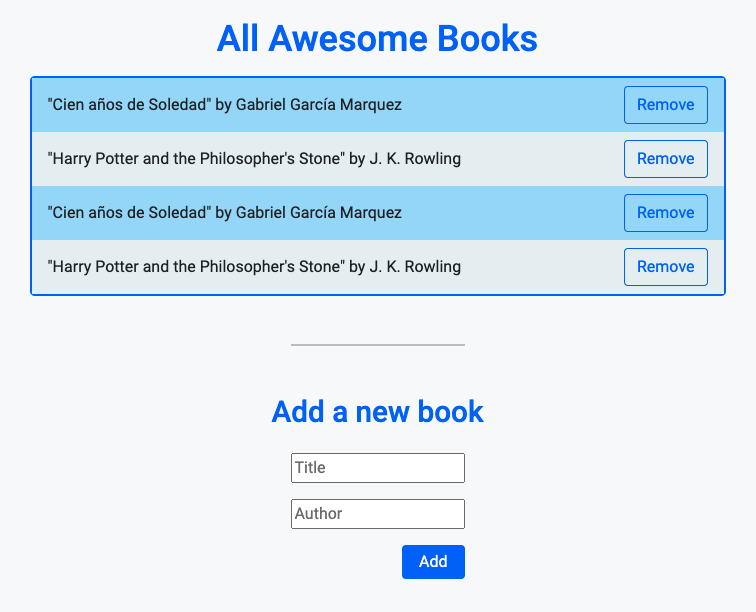

# Awesome Books

> This is my website for Awesome Books.

## Built With

- HTML & CSS & JS

## Project Setup

Clone this repository (use this SSH key git@github.com:sevinchek/awesome-books.git) and then open the index.html file with your favorite browser.

Add a book in the form and you will see it displayed in the page.
Remove a book and you will see it dissapear from the page.

## Authors

👤 **Kevin**

- GitHub: [@sevinchek](https://github.com/sevinchek)
- Twitter: [@sevinchek](https://twitter.com/sevinchek)
- LinkedIn: [LinkedIn](https://linkedin.com/in/sevinchek)

👤 **Abmasadullah**

- GitHub: [@abmasadullah](https://github.com/abmasadullah)
- Twitter: [@abmasadullah](https://twitter.com/abmasadullah)
- LinkedIn: [LinkedIn](https://linkedin.com/in/abmasadullah)

## 🤝 Contributing

Contributions, issues, and feature requests are welcome!

## Show your support

Give a ⭐️ if you like this project
